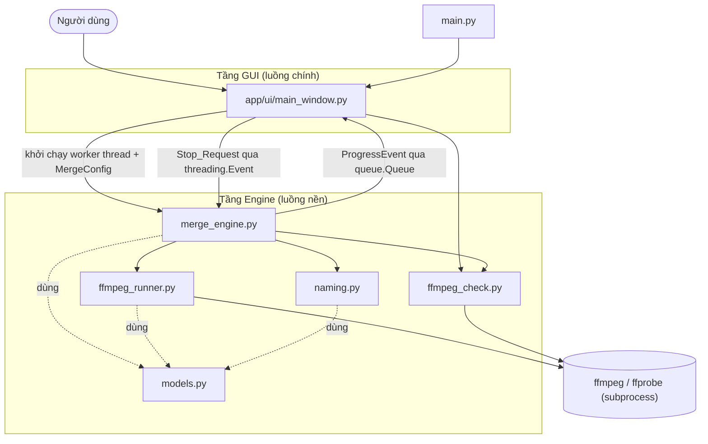
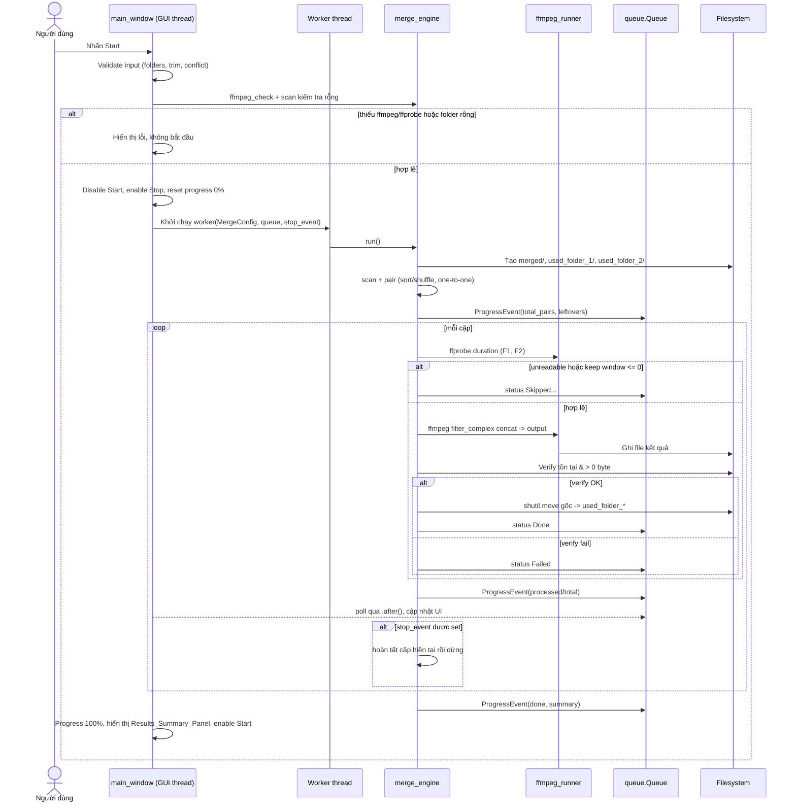

# Design Document

## Overview

Batch Video Merger là ứng dụng desktop thuần Python ghép video hàng loạt theo cặp một-đối-một từ hai thư mục nguồn. Thiết kế tách biệt rõ ràng hai tầng:

- **Tầng giao diện (`app/ui`)**: cửa sổ customtkinter hiện đại, chủ đề tối mặc định, chỉ chịu trách nhiệm nhận input người dùng và hiển thị tiến trình/trạng thái theo thời gian thực. Không chứa logic xử lý video.
- **Tầng engine (`app/engine`)**: toàn bộ logic nghiệp vụ — quét file, ghép cặp, tính cửa sổ cắt, chuẩn hóa/resize, ghép, xác minh và di chuyển an toàn. Engine **không phụ thuộc** vào customtkinter nên có thể kiểm thử độc lập với GUI.

Engine chạy trên một luồng nền (background thread). Giao tiếp giữa engine và GUI diễn ra một chiều qua một hàng đợi an toàn luồng (`queue.Queue`): engine đẩy sự kiện tiến trình/trạng thái vào hàng đợi, GUI dùng vòng lặp `.after()` của customtkinter để poll và cập nhật giao diện. Yêu cầu dừng được truyền ngược lại engine qua một `threading.Event`.

Công cụ gọi `ffmpeg`/`ffprobe` qua `subprocess`. Không dùng `moviepy`. Việc ghép hai clip có thể khác kích thước/codec được thực hiện bằng **một lệnh ffmpeg duy nhất với `filter_complex` + `concat` filter** (chuẩn hóa từng segment rồi nối) để đảm bảo độ tin cậy.

Nguyên tắc an toàn dữ liệu xuyên suốt: **không bao giờ xóa hay di chuyển video gốc trước khi file kết quả được xác minh tồn tại và có kích thước > 0 byte**. Mọi trạng thái chỉ hiển thị trên GUI — không có `report.csv`, không có `log.txt`, không có bất kỳ file báo cáo nào.

Phạm vi quyết định kỹ thuật chính:
- Ngôn ngữ: Python thuần, một repo duy nhất.
- GUI: `customtkinter` (chủ đề tối hiện đại, có toggle sáng/tối).
- Xử lý video: `ffmpeg` + `ffprobe` qua `subprocess`.
- Thư viện chuẩn: `pathlib`, `shutil`, `threading`, `queue`, `subprocess`, `dataclasses`, `enum`, `random`.
- Đóng gói: PyInstaller (onefile). `ffmpeg`/`ffprobe` phải có trên PATH hoặc được bundle kèm.

## Architecture

### Phân lớp module

| Module | Trách nhiệm |
|--------|-------------|
| `main.py` | Entry point. Khởi tạo cửa sổ, áp dụng chủ đề mặc định, chạy mainloop. |
| `app/ui/main_window.py` | Cửa sổ customtkinter chuyên nghiệp. Các nhóm: Sources, Trim settings, Output options, Actions/Progress. Nút Start (primary) / Stop (secondary), progress bar kèm % văn bản, status log dạng cuộn, panel tổng kết, toggle chủ đề. Poll queue qua `.after()`. |
| `app/engine/merge_engine.py` | Điều phối toàn bộ một lần chạy: scan → pair → (per pair) trim → normalize/resize → concat → verify → safe move. Xử lý `Stop_Request` qua `threading.Event`. Cô lập lỗi theo từng cặp. |
| `app/engine/ffmpeg_runner.py` | Bọc các lệnh `ffmpeg`/`ffprobe`. Lấy thời lượng qua ffprobe; dựng filter graph cho 9:16 fit-with-padding (scale+pad), fill-crop (scale+crop), và keep-size. Áp CRF, 30fps, yuv420p, AAC 44100Hz. |
| `app/engine/ffmpeg_check.py` | Phát hiện `ffmpeg`/`ffprobe` có khả dụng không. |
| `app/engine/naming.py` | Sinh tên file kết quả và tên file gốc đã dùng; xử lý suffix chống trùng `_1`, `_2`, ... |
| `app/engine/models.py` | Dataclasses & enum: `MergeConfig`, `PairResult`, `MergeStatus`, `ProgressEvent`. |

### Sơ đồ thành phần



### Sơ đồ tuần tự một lần chạy ghép



## Components and Interfaces

### `main.py`
Entry point. Trách nhiệm tối thiểu:
```python
def main() -> None:
    # set appearance mode = "dark", color theme
    # tạo MainWindow, chạy mainloop
```

### `app/ui/main_window.py`
Lớp `MainWindow(customtkinter.CTk)`. Chỉ tương tác với engine qua `MergeConfig`, `queue.Queue`, `threading.Event`.

Trách nhiệm và hàm chính:
```python
class MainWindow(ctk.CTk):
    def __init__(self) -> None: ...

    # --- Xây dựng UI theo nhóm ---
    def _build_sources_section(self) -> None: ...      # nút chọn F1/F2/Output + nhãn đường dẫn
    def _build_trim_section(self) -> None: ...          # Trim_Head/Trim_Tail cho F1 và F2
    def _build_output_options_section(self) -> None: ...# Merge_Order, Resize_Mode, Submode, Quality_Preset
    def _build_actions_section(self) -> None: ...       # Start/Stop, Progress_Bar, Status_Area, Results panel

    # --- Sự kiện ---
    def _on_select_folder1(self) -> None: ...
    def _on_select_folder2(self) -> None: ...
    def _on_select_output(self) -> None: ...
    def _on_resize_mode_change(self, value: str) -> None: ...  # bật/tắt Submode
    def _on_toggle_theme(self) -> None: ...

    def _on_start(self) -> None:
        # 1. build MergeConfig từ UI
        # 2. validate (folders đã chọn, trim hợp lệ, conflict, tồn tại)
        # 3. ffmpeg_check + kiểm tra thư mục rỗng
        # 4. nếu OK: disable Start, enable Stop, reset progress,
        #    spawn worker thread chạy MergeEngine.run, bắt đầu _poll_queue
    def _on_stop(self) -> None:
        # set stop_event, hiển thị "đang chờ dừng"

    # --- Cầu nối luồng ---
    def _poll_queue(self) -> None:
        # đọc tất cả ProgressEvent hiện có từ queue, cập nhật progress/status/summary
        # lên lịch lại bằng self.after(POLL_INTERVAL_MS, self._poll_queue)

    # --- Validate phía UI ---
    def _build_config(self) -> tuple[MergeConfig | None, list[str]]:
        # trả về (config, errors). errors rỗng nghĩa là hợp lệ
```

Hằng số: `POLL_INTERVAL_MS = 100`, kích thước cửa sổ tối thiểu `900x650`.

### `app/engine/merge_engine.py`
Lớp `MergeEngine` — không import customtkinter.
```python
class MergeEngine:
    def __init__(self, config: MergeConfig,
                 event_queue: "queue.Queue[ProgressEvent]",
                 stop_event: threading.Event) -> None: ...

    def run(self) -> RunSummary:
        # điều phối toàn bộ; đẩy ProgressEvent vào queue; trả RunSummary

    # --- các bước tách riêng để test ---
    def scan_folder(self, folder: Path) -> list[Path]:
        # liệt kê file trực tiếp (không đệ quy), lọc theo Supported_Format (case-insensitive)
    def pair_videos(self, files1: list[Path], files2: list[Path],
                    order: MergeOrder, rng: random.Random
                    ) -> tuple[list[tuple[Path, Path]], list[Path]]:
        # trả (pairs, leftovers). sort hoặc shuffle; one-to-one theo vị trí;
        # số cặp = min(len1, len2); leftover là phần thừa của thư mục dài hơn
    def process_pair(self, index: int, f1: Path, f2: Path) -> PairResult:
        # trim window, normalize/resize, concat, verify, safe move
```

Hàm thuần (pure) `compute_keep_window`:
```python
def compute_keep_window(duration: float, trim_head: float, trim_tail: float
                        ) -> float | None:
    # trả None nếu duration - trim_head - trim_tail <= 0, ngược lại trả thời lượng giữ lại
```

### `app/engine/ffmpeg_runner.py`
```python
class FfmpegRunner:
    def __init__(self, ffmpeg_path: str = "ffmpeg", ffprobe_path: str = "ffprobe") -> None: ...

    def probe_duration(self, path: Path) -> float:
        # ffprobe -v error -show_entries format=duration -of default=...; raise nếu lỗi/không parse được
    def probe_resolution(self, path: Path) -> tuple[int, int]:
        # ffprobe lấy width,height (dùng cho keep-size mode)

    def build_filter_complex(self, config: MergeConfig,
                             f1_res: tuple[int, int] | None) -> str:
        # dựng chuỗi filter cho từng Resize_Mode/Submode (xem mục dưới)
    def run_concat(self, f1: Path, f2: Path, output: Path,
                   keep1: TrimWindow, keep2: TrimWindow,
                   config: MergeConfig, f1_res: tuple[int, int] | None) -> None:
        # gọi một lệnh ffmpeg duy nhất; raise FfmpegError nếu exit code != 0
```

### `app/engine/ffmpeg_check.py`
```python
def check_tools(ffmpeg_path: str = "ffmpeg", ffprobe_path: str = "ffprobe") -> ToolCheckResult:
    # chạy `ffmpeg -version` / `ffprobe -version`; trả cờ ffmpeg_ok, ffprobe_ok + thông điệp hướng dẫn
```

### `app/engine/naming.py`
```python
def format_stt(index: int) -> str:
    # số thứ tự bắt đầu từ 1 -> "001"; nếu > 999 thì dùng đủ chữ số, không cắt
def merged_name(stt: str, name1: str, name2: str) -> str:
    # f"merged_{stt}__{name1}__{name2}.mp4" (name đã bỏ phần mở rộng)
def used_name(stt: str, side: str, name: str) -> str:
    # side in {"F1","F2"} -> f"{stt}_{side}_{name}.mp4"
def resolve_collision(target: Path) -> Path:
    # nếu target tồn tại, chèn _1, _2, ... ngay trước phần mở rộng cho tới khi chưa tồn tại
```

## Data Models

```python
from dataclasses import dataclass, field
from enum import Enum
from pathlib import Path

class MergeOrder(Enum):
    SORTED = "sorted"        # theo thứ tự tên file
    SHUFFLE = "shuffle"      # ngẫu nhiên

class ResizeMode(Enum):
    NINE_SIXTEEN = "9:16"    # 1080x1920
    KEEP_SIZE = "keep_size"  # giữ nguyên kích thước

class ResizeSubmode(Enum):
    FIT_PAD = "fit_pad"      # Fit with padding
    FILL_CROP = "fill_crop"  # Fill crop

class QualityPreset(Enum):
    FAST = 28        # CRF
    BALANCED = 23
    HIGH = 18

class MergeStatus(Enum):
    DONE = "Done"
    FAILED = "Failed"
    SKIPPED_TOO_SHORT = "Skipped because video too short"
    SKIPPED_UNREADABLE = "Skipped because unreadable"
    UNUSED_NO_PAIR = "Unused because no pair"

@dataclass(frozen=True)
class MergeConfig:
    folder1: Path
    folder2: Path
    output_folder: Path
    trim_head_1: float
    trim_tail_1: float
    trim_head_2: float
    trim_tail_2: float
    merge_order: MergeOrder
    resize_mode: ResizeMode
    resize_submode: ResizeSubmode      # bỏ qua khi resize_mode == KEEP_SIZE
    quality: QualityPreset
    target_width: int = 1080           # dùng cho 9:16
    target_height: int = 1920
    fps: int = 30
    audio_rate: int = 44100

@dataclass
class PairResult:
    index: int
    stt: str
    file1: Path | None
    file2: Path | None
    status: MergeStatus
    detail: str = ""                   # lý do lỗi/bỏ qua nếu có
    output_path: Path | None = None

@dataclass
class ProgressEvent:
    kind: str                          # "init" | "pair" | "status" | "done" | "stopping"
    processed: int = 0
    total: int = 0
    leftovers: int = 0
    message: str = ""
    result: PairResult | None = None

@dataclass
class RunSummary:
    succeeded: int = 0
    failed: int = 0
    unused: int = 0
    not_processed: int = 0             # số cặp chưa xử lý khi dừng do Stop_Request
    results: list[PairResult] = field(default_factory=list)
```

## Thiết kế lệnh/filter ffmpeg

Tất cả các chế độ dùng **một lệnh ffmpeg duy nhất** với `filter_complex`. Khung sườn lệnh:

```
ffmpeg -y \
  -ss <head1> -t <keep1> -i <f1> \
  -ss <head2> -t <keep2> -i <f2> \
  -filter_complex "<CHUỖI FILTER>" \
  -map "[v]" -map "[a]" \
  -c:v libx264 -crf <CRF> -pix_fmt yuv420p -r 30 \
  -c:a aac -ar 44100 \
  <output.mp4>
```

`-ss`/`-t` đặt **trước** mỗi `-i` để cắt theo cửa sổ giữ lại đã tính (`keep = duration - trim_head - trim_tail`). Mỗi input được chuẩn hóa riêng rồi `concat` để hai clip khác kích thước/codec nối được an toàn.

Quy ước nhãn: input 0 = video Folder_1, input 1 = video Folder_2. Mỗi nhánh chuẩn hóa video về `fps=30`, `setsar=1`, đặt pixel chuẩn, sau đó dùng `concat=n=2:v=1:a=1`.

### Resize_Mode = 9:16, Submode = Fit with padding
Co vừa khung 1080x1920 giữ tỉ lệ, căn giữa, lấp nền đen:
```
[0:v]fps=30,scale=1080:1920:force_original_aspect_ratio=decrease,
     pad=1080:1920:(ow-iw)/2:(oh-ih)/2:color=black,setsar=1[v0];
[1:v]fps=30,scale=1080:1920:force_original_aspect_ratio=decrease,
     pad=1080:1920:(ow-iw)/2:(oh-ih)/2:color=black,setsar=1[v1];
[v0][0:a][v1][1:a]concat=n=2:v=1:a=1[v][a]
```

### Resize_Mode = 9:16, Submode = Fill crop
Phủ đầy khung 1080x1920 giữ tỉ lệ rồi cắt cân giữa:
```
[0:v]fps=30,scale=1080:1920:force_original_aspect_ratio=increase,
     crop=1080:1920,setsar=1[v0];
[1:v]fps=30,scale=1080:1920:force_original_aspect_ratio=increase,
     crop=1080:1920,setsar=1[v1];
[v0][0:a][v1][1:a]concat=n=2:v=1:a=1[v][a]
```

### Resize_Mode = giữ nguyên kích thước (keep-size)
Chuẩn hóa clip Folder_2 về đúng `WxH` của clip Folder_1 (đo bằng `ffprobe`), giữ tỉ lệ + lấp nền đen nếu lệch tỉ lệ. Clip Folder_1 giữ kích thước gốc:
```
[0:v]fps=30,setsar=1[v0];
[1:v]fps=30,scale=<W1>:<H1>:force_original_aspect_ratio=decrease,
     pad=<W1>:<H1>:(ow-iw)/2:(oh-ih)/2:color=black,setsar=1[v1];
[v0][0:a][v1][1:a]concat=n=2:v=1:a=1[v][a]
```
trong đó `<W1>`, `<H1>` là chiều rộng/chiều cao của clip Folder_1.

Lưu ý xử lý âm thanh: nếu một input thiếu audio stream, runner sẽ chèn `anullsrc` hoặc dùng cờ `-f lavfi` để tạo track câm tương ứng nhằm giữ `concat` hợp lệ; chi tiết do `FfmpegRunner` đảm nhiệm và được kiểm thử ở mức integration.

## Mô hình luồng & đồng thời (Threading & concurrency)

- **GUI thread (luồng chính)**: chạy `mainloop` của customtkinter. Mọi cập nhật widget chỉ xảy ra ở luồng này.
- **Worker thread (luồng nền)**: một `threading.Thread` duy nhất chạy `MergeEngine.run`. Toàn bộ I/O nặng (ffprobe/ffmpeg/move) nằm ở đây để GUI không treo (Req 8.10).
- **Kênh tiến trình**: `queue.Queue[ProgressEvent]`. Engine `put()` không chặn; GUI `get_nowait()` trong `_poll_queue` đến khi rỗng, rồi `self.after(100, ...)`. Đây là cơ chế an toàn luồng duy nhất để dữ liệu đi từ worker sang GUI.
- **Dừng**: `threading.Event`. `_on_stop` gọi `stop_event.set()`. Engine kiểm tra `stop_event.is_set()` ở **đầu mỗi vòng lặp cặp**; nếu đã set thì hoàn tất cặp đang xử lý (nếu đang giữa chừng) rồi thoát trước khi bắt đầu cặp kế tiếp (Req 9.2).
- **Vòng đời**: khi worker kết thúc (hoàn tất hoặc dừng), nó đẩy `ProgressEvent(kind="done", ...)`; GUI nhận được sẽ bật lại nút Start (Req 9.7) và hiển thị tổng kết.

## Error Handling

Chiến lược: **cô lập lỗi theo từng cặp** — một lỗi đơn lẻ không bao giờ làm hỏng cả lần chạy (Req 10.5).

| Tình huống | Xử lý | Trạng thái |
|-----------|-------|-----------|
| Thiếu Folder/đường dẫn (Req 1.6) | Validate trước khi chạy; không bắt đầu | Thông báo lỗi GUI |
| Xung đột thư mục (Req 1.7) | Validate; không bắt đầu | Thông báo lỗi GUI |
| Thư mục không tồn tại/không truy cập được (Req 1.8) | Validate; không bắt đầu | Thông báo lỗi GUI |
| Trim không hợp lệ (Req 2.3) | Validate ô nhập; không bắt đầu | Thông báo lỗi GUI |
| Thiếu ffmpeg/ffprobe (Req 10.2) | `ffmpeg_check` trước khi chạy; không bắt đầu | Thông báo + hướng dẫn cài đặt |
| Thư mục nguồn rỗng (Req 10.3) | Kiểm tra sau scan; không bắt đầu | Thông báo nêu rõ thư mục rỗng |
| Không tạo được thư mục con (Req 7.2) | Bắt `OSError`; không bắt đầu | Thông báo lỗi GUI |
| ffprobe lỗi/không đọc được (Req 4.4) | `try/except` quanh probe | `Skipped because unreadable` + lý do, tiếp tục |
| Keep window <= 0 (Req 4.3) | `compute_keep_window` trả None | `Skipped because video too short`, tiếp tục |
| ffmpeg exit != 0 hoặc output không hợp lệ (Req 10.4) | Kiểm tra exit code + verify file | `Failed` + lý do, giữ gốc, tiếp tục |
| Không đủ quyền move (Req 7.6) | Bắt `OSError`/`PermissionError` | `Failed` + lý do move, giữ gốc, tiếp tục |
| Video thừa không cặp (Req 3.7) | Tính trong `pair_videos` | `Unused because no pair` mỗi file thừa |

Mỗi `process_pair` được bọc trong `try/except Exception`: bất kỳ ngoại lệ không lường trước nào cũng được chuyển thành `PairResult(status=FAILED, detail=...)` để vòng lặp tiếp tục an toàn. Trước khi move, engine luôn verify `output.exists() and output.stat().st_size > 0` (Req 7.3); chỉ khi đạt mới `shutil.move` rồi verify đích tồn tại (Req 7.4).

## Correctness Properties

*A property is a characteristic or behavior that should hold true across all valid executions of a system-essentially, a formal statement about what the system should do. Properties serve as the bridge between human-readable specifications and machine-verifiable correctness guarantees.*

### Property 1: Mỗi video nguồn được dùng nhiều nhất một lần

*For any* hai danh sách file Folder_1 và Folder_2 với mọi Merge_Order, tập hợp các file xuất hiện trong các cặp ghép cộng với tập hợp các file leftover phải là một phân hoạch không trùng lặp của file nguồn — không file nào xuất hiện trong hai cặp, và không file nào vừa được ghép vừa là leftover.

**Validates: Requirements 3.5**

### Property 2: Số cặp bằng min của hai số lượng

*For any* hai danh sách file Folder_1 và Folder_2, số cặp được tạo bởi `pair_videos` luôn bằng `min(len(files1), len(files2))`, và số file leftover bằng `abs(len(files1) - len(files2))`.

**Validates: Requirements 3.4, 3.6, 3.7**

### Property 3: Ghép cặp theo vị trí một-đối-một

*For any* hai danh sách file sau khi sắp xếp/xáo trộn, cặp tại chỉ số N luôn gồm phần tử thứ N của danh sách Folder_1 đã xử lý và phần tử thứ N của danh sách Folder_2 đã xử lý.

**Validates: Requirements 3.4**

### Property 4: STT là duy nhất và tăng đơn điệu

*For any* số lượng cặp được ghép, dãy STT sinh ra cho các cặp là duy nhất từng đôi một, bắt đầu từ "001" và tăng đều 1 đơn vị theo thứ tự cặp; khi giá trị vượt 999 thì biểu diễn dùng đủ chữ số mà không mất thông tin số (`int(format_stt(n)) == n`).

**Validates: Requirements 6.1, 6.2, 6.5**

### Property 5: Cùng một cặp dùng chung một STT

*For any* cặp đã ghép thành công, tên file kết quả, tên file used Folder_1 và tên file used Folder_2 đều chứa cùng một chuỗi STT.

**Validates: Requirements 6.3, 6.4, 6.5**

### Property 6: Giải quyết trùng tên luôn cho tên duy nhất

*For any* thư mục đích chứa một tập hợp tên file đã tồn tại bất kỳ, `resolve_collision` luôn trả về một đường dẫn chưa tồn tại trong thư mục đó; nếu tên gốc đã tồn tại thì tên trả về có dạng `<stem>_<n><ext>` với `n >= 1`.

**Validates: Requirements 6.6**

### Property 7: Cửa sổ cắt đúng và bỏ qua khi không dương

*For any* thời lượng gốc `d >= 0` và mọi `trim_head, trim_tail >= 0`, `compute_keep_window` trả về `None` khi và chỉ khi `d - trim_head - trim_tail <= 0`; ngược lại trả về đúng giá trị `d - trim_head - trim_tail > 0`.

**Validates: Requirements 4.2, 4.3**

### Property 8: Quét file lọc đúng định dạng, không phân biệt hoa thường, không đệ quy

*For any* tập hợp tên file với phần mở rộng tùy ý (gồm cả hoa/thường và file trong thư mục con), `scan_folder` chỉ trả về các file nằm trực tiếp trong thư mục gốc có phần mở rộng thuộc Supported_Format khi so khớp không phân biệt hoa thường, và không bao giờ trả về file trong thư mục con.

**Validates: Requirements 3.1**

### Property 9: Gốc chỉ được di chuyển khi output đã xác minh

*For any* kết quả xử lý cặp, nếu file gốc được di chuyển sang Used_Folder thì file kết quả tương ứng phải tồn tại và có kích thước > 0 byte; nếu cặp thất bại (output không tồn tại hoặc 0 byte) thì cả hai file gốc vẫn nằm tại thư mục gốc.

**Validates: Requirements 7.3, 7.4, 7.5, 10.4**

## Testing Strategy

### Cách tiếp cận kép
- **Unit test**: kiểm thử các hàm thuần của engine với ví dụ cụ thể và edge case.
- **Property-based test**: kiểm thử các thuộc tính phổ quát ở mục Correctness Properties trên nhiều input sinh ngẫu nhiên.
- **Integration test**: kiểm thử pipeline ffmpeg thật với video mẫu nhỏ.
- **GUI**: kiểm thử thủ công (manual) — customtkinter không phù hợp tự động hóa property-based; các tiêu chí UI (Req 1, 2, 8, 9 phần hiển thị) được xác minh tay theo checklist.

### Thư viện
- Property-based testing: **Hypothesis** (chạy tối thiểu 100 iteration mỗi property). Không tự cài đặt PBT từ đầu.
- Unit/integration: `pytest`.

### Phân lớp kiểm thử

**Unit tests (engine, thuần, không cần ffmpeg):**
- `pair_videos`: số cặp = min, leftover đúng, sort/shuffle, one-to-one.
- `naming.format_stt` / `merged_name` / `used_name`: định dạng STT, vượt 999.
- `resolve_collision`: chèn suffix khi trùng.
- `compute_keep_window`: cửa sổ cắt, biên `<= 0`.
- `scan_folder`: lọc định dạng, case-insensitive, không đệ quy.
- Phân loại leftover (Req 3.7).

**Property-based tests (Hypothesis, >= 100 iteration):** mỗi property ở mục Correctness Properties được hiện thực bằng **một** property test, gắn tag:
`# Feature: batch-video-merger, Property <number>: <property_text>`

**Integration tests (ffmpeg thật, vài ví dụ):**
- Sinh 2–3 video mẫu nhỏ bằng ffmpeg (`testsrc`/`sine`, vài giây, khác kích thước) trong fixture.
- Chạy `process_pair` end-to-end và kiểm tra: output `.mp4` tồn tại, > 0 byte, đúng 30fps/yuv420p/AAC 44100Hz (xác minh lại bằng ffprobe), và gốc đã được move.
- Mỗi Resize_Mode/Submode chạy 1 ví dụ để xác minh filter graph hợp lệ.
- `ffmpeg_check` với đường dẫn không tồn tại để xác minh phát hiện thiếu công cụ.

**Cân bằng:** ưu tiên property test cho phần logic phổ quát; hạn chế unit test trùng lặp; integration test giữ ở mức tối thiểu vì chi phí cao.

## Đóng gói (Packaging)

- Đóng gói bằng **PyInstaller** chế độ **onefile**: `pyinstaller --onefile --windowed main.py`.
- `ffmpeg`/`ffprobe` **phải có trên PATH** hoặc được bundle kèm (thêm qua `--add-binary` và phân giải đường dẫn lúc chạy). `ffmpeg_check` chạy đầu mỗi lần Start để xác nhận khả dụng (Req 10.1, 10.2).
- Tài liệu hướng dẫn (Req 11) liệt kê thư viện Python (`customtkinter`), lệnh cài đặt, các bước cài ffmpeg/ffprobe trên Windows + bước kiểm tra, cách chạy từ mã nguồn, cách đóng gói `.exe`, và giải thích cấu trúc thư mục đầu ra.
